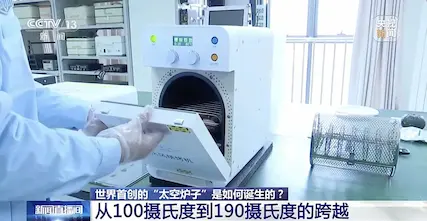

# 每周分享周刊（第1期）：马拉松为什么集体“扑街”

  这里记录每周值得分享的内容，周六发布

  周刊内容 [主要来源](https://github.com/ruanyf/weekly) 欢迎 [投稿](https://github.com/Jonk-Wu/tech-weekly/issues) 同步发布 [公众号:温暖日常]

## 封面图

  上周末，杭马pb 枪声成绩：01:58:35，净成绩：01:50:16 

  

  马拉松凉了？不是因为大家不爱跑步了，而是因为有些地方办赛办得有点“走火入魔”。
  
  今年十月份，全国各地的马拉松跟拉了个“摆烂群”似的，集体停摆。

  山西临汾，不跑了；山东多个县市，审批直接上收，不跟你多BB；罗浮山半马发布后又删除，此前官宣11月2日开跑的2025翁源半马也不了了之；
  连河北蠡县这种以往凑热闹也要搞个“欢乐跑”的小地方，今年也彻底哑火。

   

  大家公告写得那叫一个冠冕堂皇，不是“天气原因”就是“出于安全考虑”。
  
  但实际上呢？
  
  是这场蒙眼狂奔了十年的“马拉松大跃进”，终于被现实抡园了膀子，结结实实踩下了一脚急刹车。
  
  我们看看马拉松这个事前几年是什么光景？
  
  是个城市就想搞“马”，好像不办个马拉松，你都不好意思说自己是现代化都市。有那么一段时间，“某马”成了城市最光鲜的金名片，朋友圈不发个定位和奖牌，你都不好意思说自己是中产。

  但狂欢的背后，是市民被堵在路上的骂娘，是财政钱包被掏空的心疼，是安全风险悬在头顶的达摩克斯之剑。

  所以，这脚刹车，它不是不让你跑步，不是扼杀全民健身的热情。
  
  是让你别瞎跑！

## 新闻

1、[太空烧烤](https://mp.weixin.qq.com/s/k_JEhu-XMEPqDSlQToM4tA)

11月4日0时，神舟二十号和神舟二十一号航天员乘组进行交接仪式，两个乘组移交了空间站的钥匙。

4日中午，航天员们在空间站撸串、吃烧烤。这离不开神舟二十一号任务，为太空厨房添加的新设备————热风烘烤机（据说可以无烟处理）

2、

## 医学

1、人类为什么需要睡眠？最近一篇论文指出，睡眠与[细胞线粒体](https://www.science.org/content/blog-post/it-all-comes-down-mitochondria)有关。

在有氧状态下，线粒体的不间断活动会导致自身裂变，所以需要一个静止期（睡眠）来修复，并补充能量。

结论就是，只要生物需要氧气，就需要睡眠，因为有氧活动会消耗线粒体。

## 文摘

## 本周感悟

一位出色的数据库及信息系统开发者不仅需要精通计算机语言，还要了解各行各业的知识背景，只有充分了解客户需求，才能做出一个功能符合预期的信息系统。

这也是一位出色的产品经理所应该具备的————沟通和学习能力
