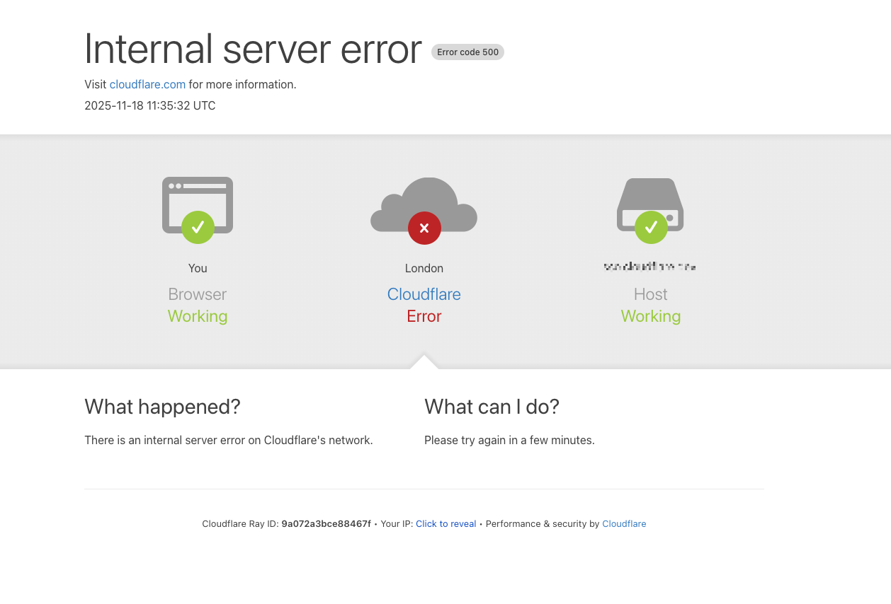

# Jonk的科技周刊（第3期）：
这里记录每周值得分享的内容，周六发布

周刊内容 [主要来源](https://news.ycombinator.com/) 欢迎 [投稿](https://github.com/Jonk-Wu/tech-weekly/issues) 同步发布 [公众号:温暖日常] 浏览[网页版](https://tech-weekly.jonk.dpdns.org)

## 封面图

## 新闻

1、[Cloudflare于2025年11月18日发生重大故障](https://blog.cloudflare.com/18-november-2025-outage/)，6小时之后才恢复。这是[自2019年以来](https://blog.cloudflare.com/details-of-the-cloudflare-outage-on-july-2-2019/)最严重的故障。
原因是数据库权限变化，导致特征文件里出现大量重复特征，特征文件大小翻倍，超过了核心代理软件可处理的最大特征数量，导致模块崩溃。

2、

## 文章

1、利用诗歌对大语言模型进行越狱攻击，从而跳脱大语言模型的安全限制，[研究表面](https://arxiv.org/abs/2511.15304)，成功率非常高，部分模型甚至高达90%。这暴露出了大语言模型目前存在的安全漏洞。这篇[论文](https://crad.ict.ac.cn/cn/article/doi/10.7544/issn1000-1239.202330962?viewType=HTML)是对不同形式的越狱攻击的详细介绍和解释。

2、[Go密码学现状](https://words.filippo.io/2025-state/)。总结：Go 在过去一年里完成了一个几乎不可能的目标：既拥抱后量子密码学，又通过严格的 FIPS 140 合规，同时不降低安全性，还把性能提升了一大截。

## 图片

## 本周进展

1、借助Claude Code结合React App模版做了一个[互动故事小游戏](https://tech-weekly.jonk.dpdns.org/)

2、本周三参加了“雏鹰计划”月会，会上老师介绍了温附一医智能体、医院网络拓扑图等。

3、数据库大作业进度（8%/100%），仅实现了注册功能，忘记密码模块预加模拟验证码校验过程（待完成），未做优化和系统封装，进度稍稍落后，预计下周要基本实现大作业原计划的所有功能。

## 本周感悟

