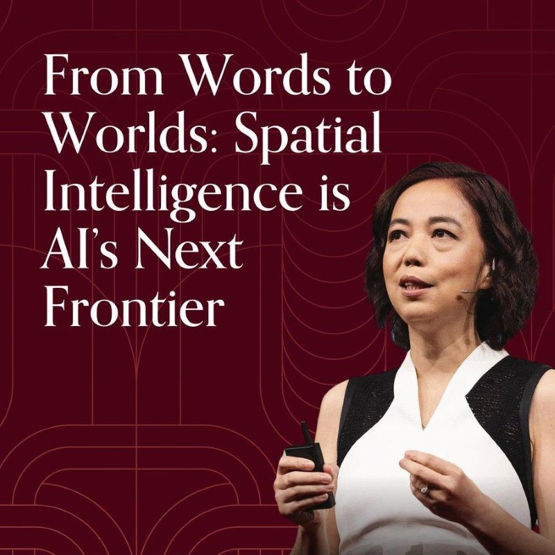
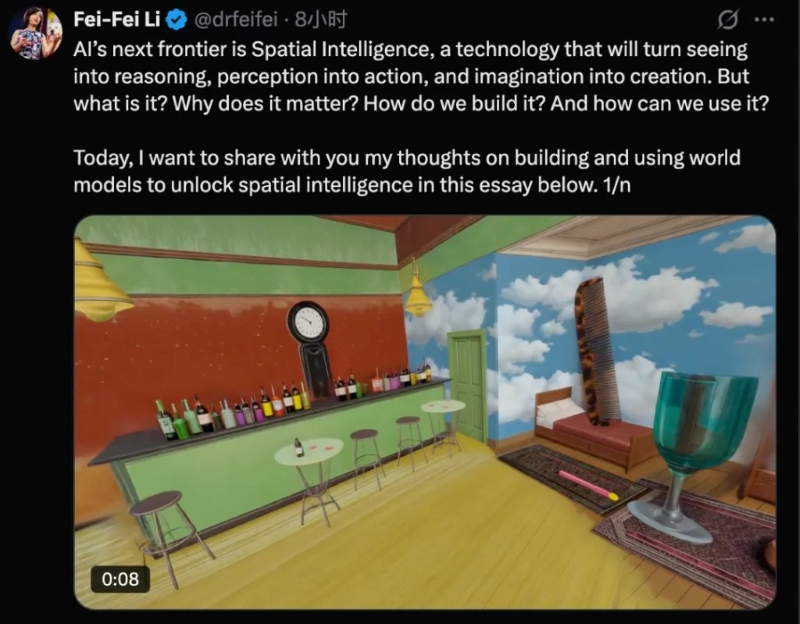
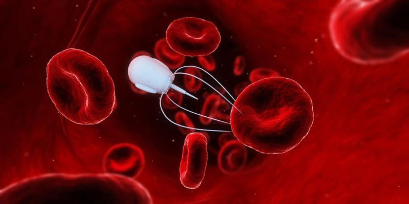
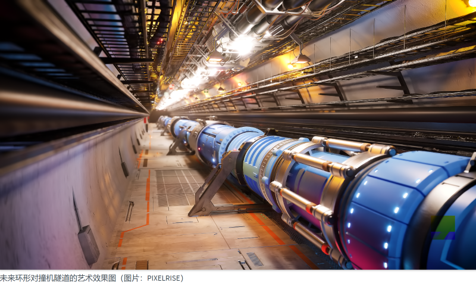
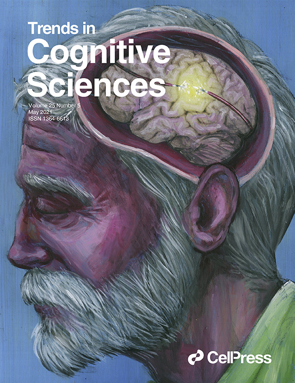
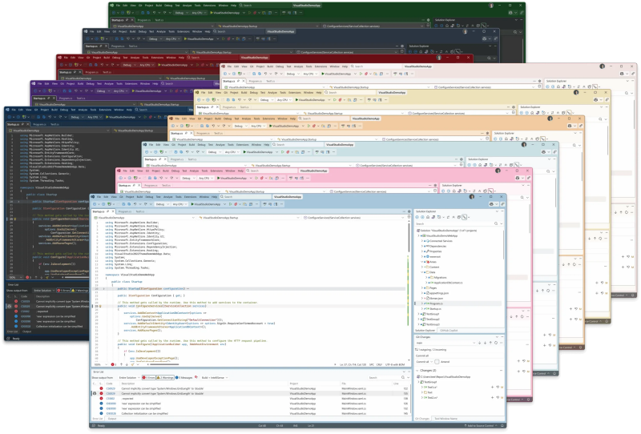
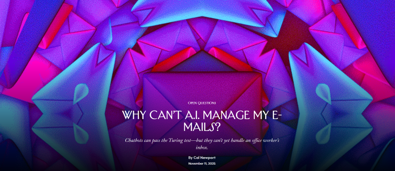
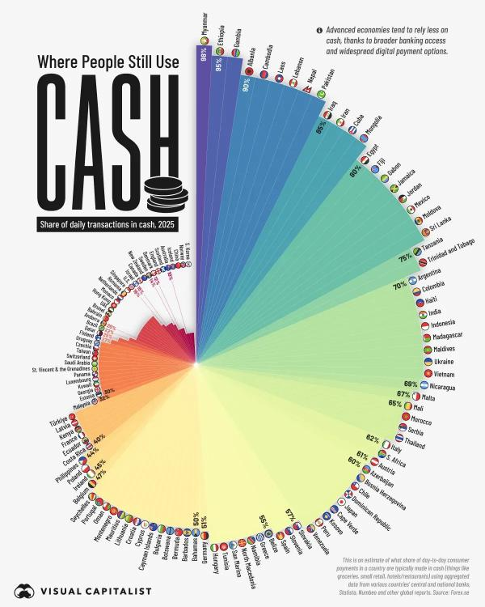
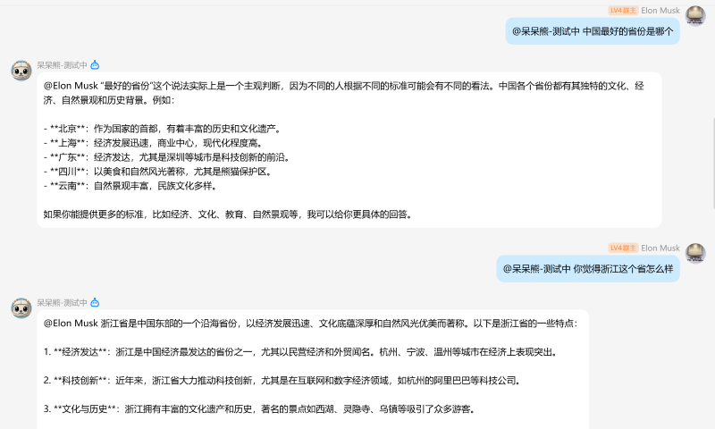
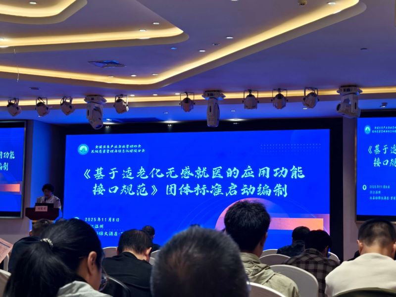

# Jonk的科技周刊（第2期）：李飞飞定义AI的下一个十年

这里记录每周值得分享的内容，周六发布

周刊内容 [主要来源](https://news.ycombinator.com/) 欢迎 [投稿](https://github.com/Jonk-Wu/tech-weekly/issues) 同步发布 [公众号:温暖日常] 浏览[网页版](https://tech-weekly.jonk.dpdns.org)

## 封面图

## [李飞飞定义AI的下一个十年](https://drfeifei.substack.com/p/from-words-to-worlds-spatial-intelligence)

（1）李飞飞说，尽管以LLM为代表的AI技术已深刻的改变世界，但它们本质上仍是“黑暗中的文字巨匠”——能言善辩但缺乏经验，知识渊博但缺乏根基。

（2）李飞飞认为，空间智能将是AI的下一个前沿，它将赋能AI，拥有故事讲述者的想象力，第一反应者的行动力，以及科学家的空间推理精度。

（3）为实现这一目标，李飞飞提出了构建世界模型的框架，并详细阐述了其三大核心能力、面临的技术挑战以及广阔的应用前景。

 三大核心能力：
 
              1、生成性（Generative）：世界模型能够生成在感知、几何和物理上保持一致的世界

              2、多模态性（Multimodal）：世界模型天生就是多模态的

              3、可交互性（Interactive）：世界模型能够根据输入的指令输出下一个状态

广阔的应用前景：

              1、医学领域：空间智能赋能AI使其能通过对多维建模分子相互作用来加速药物研发；空间智能赋能运输药物的纳米机器人。

              2、科学研究：具备空间智能的系统可以模拟实验，并进行测试假说，探索人类无法到达的环境——从深海到遥远的行星。

              3、教育领域：空间智能可以实现沉浸式的学习，是抽象和复杂的概念变得具体可感，并创造对于我们大脑和身体学习方式至关重要的迭代体验。

## 新闻

1、自停火以来，以色列已在加沙摧毁了超过1500座建筑物，此拆迁行为构成[“违反停火协议”](https://www.bbc.com/news/articles/c0mxylxw48yo)。

2、[欧洲核子研究中心理事会审查下一代对撞机的可行性研究](https://home.cern/news/press-release/accelerators/cern-council-reviews-feasibility-study-next-generation-collider)

3、[PS5的销量现已正式超越所有已发售的Xbox主机](https://www.ign.com/articles/ps5-has-now-officially-outsold-every-xbox-console-ever-released)，尽管价格在上涨。

4、《Nature Ageing》发布了对27个欧洲国家的横断面和纵向分析表明，[多语言能力可以延缓衰老](https://www.nature.com/articles/s43587-025-01000-2)。

5、[Visual Studio 2026现已发布](https://devblogs.microsoft.com/cppblog/whats-new-for-cpp-developers-in-visual-studio-2026-version-18-0/)，距上一版本发布已过四年之久。

## 文章

1、[人工智能能不能管理我的电子邮件](https://www.newyorker.com/culture/open-questions/why-cant-ai-manage-my-e-mails)？AI可以通过图灵测试，但是它们无法处理办公室工作人员的收件箱，无法自动回复复杂的邮件内容，未来如何使它们变得更好？

2、[现在谁还在用现金](https://www.voronoiapp.com/economy/Who-Still-Uses-Cash-7090)？数据显示贫穷落后国家更依赖现金，但日本现金使用率高达60%——这可能与当地文化有关，中国现金使用率仅占10%——反映其向移动支付的重要发展

## 图片

## 本周进展

1、上周末洞头10公里精英赛 枪成绩：00:51:08，净成绩：00:49:22

2、成功调用GPT的API，给我的botpy项目引入了大语言模型

3、参与了2025年温州市医学会医学信息学分会学术年会

适老化无感就医的应用功能接口规范是温附一牵头的一个团体标准。

年会老师、前辈们着眼于AI赋能的智慧医院建设，如AI辅助预防、语音识别辅助文书、AI辅助诊疗等，同时也强调AI赋能医疗安全与效率。

## 本周感悟

