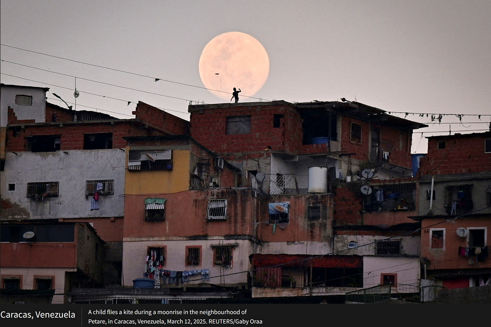

# Jonk的科技周刊（第5期）：《Mad Men》4K修复版惨遭“翻车事件”
这里记录每周值得分享的内容，周六发布

周刊内容 [主要来源](https://news.ycombinator.com/) 欢迎 [投稿](https://github.com/Jonk-Wu/tech-weekly/issues) 同步发布 [公众号:温暖日常] 浏览[网页版](https://tech-weekly.jonk.dpdns.org)

## 封面图

从前有颗名为B-612的小行星，上面住着[小王子](https://zh.wikipedia.org/wiki/%E5%B0%8F%E7%8E%8B%E5%AD%90)。这颗行星面积不大，上面有两座活火山、一座死火山和一朵玫瑰。小王子离开B-612后，访问了六颗行星，上面分别住着国王、爱慕虚荣的人、醉酒的人、商人、守时的人（点灯人）和地理学家。最后，小王子拜访了地球，然后离开回到了自己的星球。

##  [《Mad Men》在HBO Max的4K修复版惨遭“翻车事件”](https://fxrant.blogspot.com/2025/12/the-mad-men-in-4k-on-hbo-max-debacle.html)
1、上个月，华纳兄弟探索频道宣布，《广告狂人》不仅将登录[HBO Max](https://www.hbomax.com/)，还将首次以惊艳的4K画质播出。这部备受关注的剧集首播原本有望成为HBO Max电视史上一颗闪亮的明珠，但却惨遭翻车。

2、据我所知，[保罗·海恩是第一个注意](https://bsky.app/profile/paulhaine.bsky.social/post/3m6ytn4qmyc2r)到剧情存在异常的人。从画面中可以明显看到工作人员正在右下角调试用于呕吐特效的流量管，这在原片中本来是没有的。

3、**大量原本应该经过后期特效处理的镜头，变成了“未处理的原始拍摄素材”。**以下是其他一些翻车的地方：

原版经过视觉特效将环境打造成符合1960年代的纽约，两侧还加入了符合时代背景的纽约垃圾桶。而修复版特效丢失了。

原版黑屏的字在修复后也变成了全黑屏，一直持续3s，让观众不知道在看什么。

原本将酒店墙上的广告通过数字技术删除了，而修复后没有，看起来是在一家酒店大堂（可能是洛杉矶的比尔特莫酒店）拍摄的。

4、对老电影、老影视剧进行修复本来是一件振奋人心的事，但是修复者为了刻意提高画质和适应新的宽高比而裁剪掉了剧情本身给观众的一些视觉提示，不但没有提高影片质量，反而大大降低了观众的观看体验，这与媒体修复精神背道而驰，是非常糟糕的！广大制片人应该引以为戒，在修复和审查上下足功夫，仔细打磨每一处细节，让经典影视作品能够继续发光发热。

## 新闻
1、[男子接受干细胞移植后意外治愈艾滋病](https://www.newscientist.com/article/2506595-man-unexpectedly-cured-of-hiv-after-stem-cell-transplant/)。这是第七位摆脱艾滋病毒感染的患者，也是第二位接受的干细胞并非具有抗病毒能力的。目前人们仍努力通过[基因编辑免疫细胞](https://www.newscientist.com/article/2423108-crispr-could-disable-and-cure-hiv-suggests-promising-lab-experiment/)来治愈艾滋病，并[通过疫苗来预防艾滋病](https://www.newscientist.com/article/2490444-human-trials-point-the-way-towards-an-mrna-vaccine-against-hiv/)**。**

2、[一种能将火星土壤转换成氧气的微生物](https://scienceclock.com/microbe-that-could-turn-martian-dust-into-oxygen/)。研究人员发现了一种微生物，名为[色球菌](https://en.wikipedia.org/wiki/Extremophile)（Extremophile），即使在像火星这样恶劣的环境下，也能自主繁殖并且产生氧气。如果能够在火星上大面积繁殖这种微生物，或许能够解决人类的呼吸问题。

3、[OpenAi发布“红色警戒”](https://www.theverge.com/news/836212/openai-code-red-chatgpt)，谷歌在人工智能竞赛中正迎头赶上。OpenAi这家初创公司曾经不可撼动的领先优势正在一点一点的失去。

4、2025年伊朗和俄罗斯的审查升级，[Tor面临前所未有的封锁压力](https://blog.torproject.org/staying-ahead-of-censors-2025/)。但Tor通过Snowflake、Conjure、WebTunnel等新技术的改进，以及实时监测与动态协作，成功保持在高压环境下提供可访问的匿名网络。

5、年轻人对新闻的关注度创历史最低。据Pewer Research  Center的文章《[青年人与新闻的未来](https://www.pewresearch.org/journalism/2025/12/03/young-adults-and-the-future-of-news/)》，年轻人对新闻的主要来源为社交媒体，并且对社交媒体的信任度异常高，对新闻的感受更负面。

## 文章
1、[C语言中的URL。](https://susam.net/url-in-c.html)C语言本身并没有URL，但这段代码为什么可以编译？答案就藏在":" 前被C语言编译成标签 ， "//"后是注释。结论：C语言虽然没有URL，但是可以编译URL。

2、[跑步是不伤膝盖的](https://www.douyin.com/video/7572517107116608820)，骑自行车是可以保护膝盖的，深蹲是最伤膝盖的运动。访谈深度对话上海新华医院何继业医生，聊了常见的运动损失，感兴趣的可以看看，感觉讲得还挺好的。

3、[一篇不丹的游记](https://apropos.substack.com/p/notes-on-bhutan)。作者去不丹旅行，震惊于这个小国正在进行的**超大胆治理实验**：他们在边境建一座**比新加坡大三倍的“未来城市”（**[**GMC**](https://gmc.bt/)**）**， 想用 40 年时间探索一种 **融合文化、可持续、创新、民主+君主制** 的新发展模式，同时避免像其他国家那样被全球化吞没文化。  

4、[如何写好一篇播客？](https://flowtwo.io/post/on-10-years-of-writing-a-blog-nobody-reads)作者维护了一个无人问津的博客账号十年，并总结了一些写作经验，对我很有帮助。

## 图片
1、[路透社年度照片](https://www.reuters.com/investigates/special-report/year-end-2025-photos-best/)。

2、[瑞士新开了一家小王子博物馆](https://www.lepetitprince.com/en/events-around-the-world/a-new-little-prince-museum-has-opened-its-doors-in-switzerland/)。《小王子》出版于1943年，畅销全世界。11月7日，博物馆正式开幕。安托万·德·圣埃克苏佩里的侄孙、圣埃克苏佩里·达盖继承人协会主席奥利维耶·达盖出席了开幕式。

## 本周进展
1、上周六参加了反问题与计算数学研讨会。反问题在我们现实生活有非常多的应用场景，如：医学CT扫描、地震勘测、AI识别等。按我自己的理解，通过获取到的数据推到出原因，也就是溯源，这就是反问题。通过对反问题的研究，我们可以找到病灶、发现油气资源等。

会议地点在温州肯恩大学，一所由温州大学和美国肯恩大学联合开办的学校。下午参观校园后，感受到了浓厚的学术与文化交融的氛围。

2、数据库大作业进度（40%/100%），初步实现所有功能，包括患者挂号、医生诊疗开药等，并根据localcafe-lite（一个github上的开源项目），通过Elixir自主搭建了一个医生介绍的静态网站（目前托管在vercel），下周计划对代码进行逻辑梳理和分层。

## 本周感悟
1、科技行业总是充满“末日论”（doom saying），但没有一次是真正灭亡的。

--[Jason Scheirer](https://www.jasonscheirer.com/)，一名软件工程师

2、大模型时代，我们正在失去自己的声音。

--[《大模型让我们失去声音》](https://tonyalicea.dev/blog/were-losing-our-voice-to-llms/)

个人独特的声音是一种宝贵的资产，能让你与众不同，能够给他人印象并搭建信任带来机会。而在LLM中，我们的声音开始萎缩，被大语言所淹没。保持自己的声音，最好的办法就是写作，保持输出观点，敢于表达。个人的声音应该随着年龄增长、阅历增加、人生变化自然的成长，而不是因懒惰将声音让位给大语言模型。
