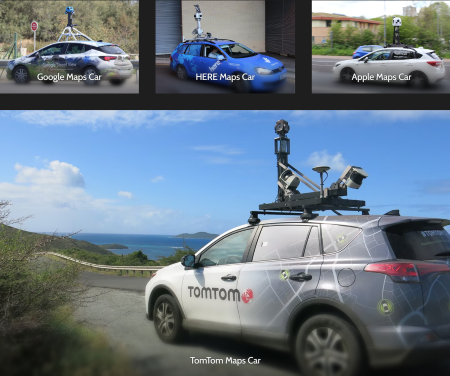
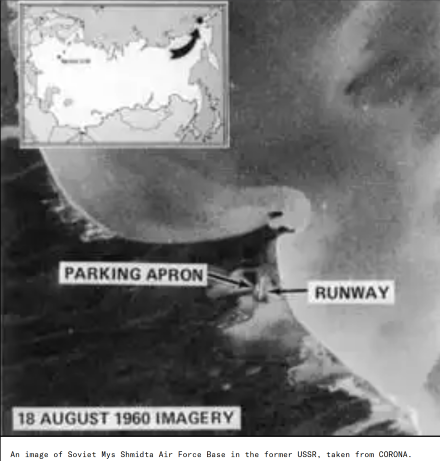
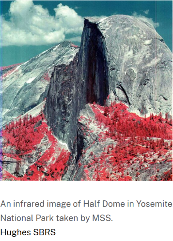
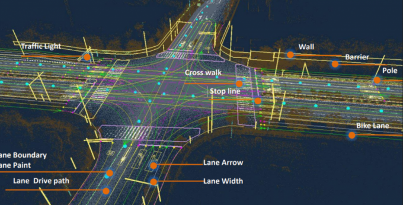
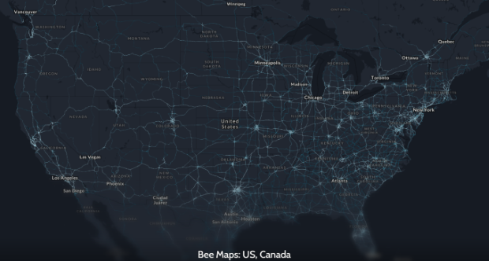
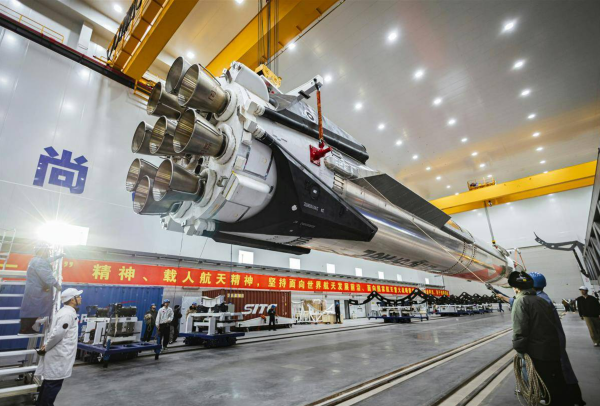
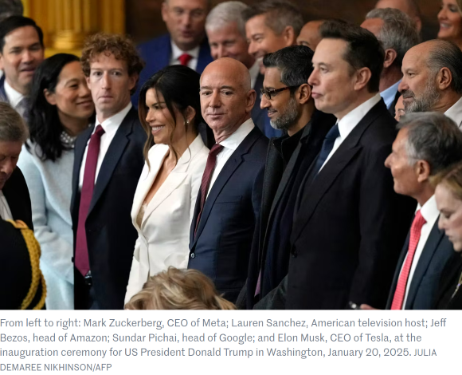
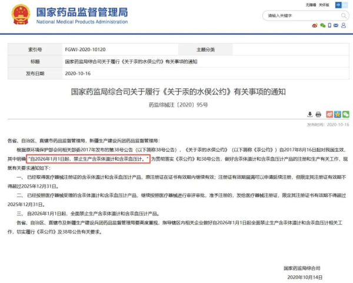

<h1 id="MTAD7">Jonk的科技周刊（第6期）：“蜂群”正在重绘世界</h1>
这里记录每周值得分享的内容，周六发布

周刊内容 [主要来源](https://news.ycombinator.com/) 欢迎 [投稿](https://github.com/Jonk-Wu/tech-weekly/issues) 同步发布 [公众号:温暖日常] 浏览[网页版](https://tech-weekly.jonk.dpdns.org)

<h2 id="RvFDm">封面图</h2>

《太空歌剧院》是由人工智能在2022年创作的一副画，获得了科罗拉多州博览会数字绘画的首奖，这件事在当时引起了很大争议，作者Jason M. Allen也受到了很多人的批评指责。

<h2 id="I2yKa">[Bee Maps](https://beemaps.com/?)的崛起——“蜂群”正在重绘世界</h2>
1、在20世纪，数字地图的制作异常困难。因为那时候还没有卫星，地图全靠人工数字化。后来，苹果、谷歌、 TomTom、HERE等公司开始用专业测绘车队来采集数据，但价格非常贵，也不能覆盖所有地区，并且更新周期长（街景常常是一年或者更久）。

2、1960年8月14日，美国CORONA（冠状）计划的KH-1侦查卫星成功带回了[第一批卫星影像](https://www.cia.gov/legacy/museum/exhibit/corona-americas-first-imaging-satellite-program/)。

3、1972年，首次发射了一颗专门用于地球资源观测的卫星—— [Landsat 1](https://science.nasa.gov/mission/landsat-1/) ，这标志着卫星影像正式进入GIS领域，具有里程碑式的意义。

4、但是，卫星影像的精度只能到达米级，而自动驾驶技术所需要的地图精度要达到厘米级别，显然这通过目前的卫星影像技术是无法实现的。为了得到高精度地图数据，仍然需要人工测绘。

5、但是如何解决人工测绘价格高、更新速度慢的问题？Bee给出了答案。他们制造出了一个集合小型摄像头、深度摄像头和高精度GPS的一个设备，类似行车导航仪，安装非常简单。再由普通司机开车便可自动采集道路数据。

6、为了激励司机，Bee根据他们采集的数据量发放加密货币HONEY，采集越多，赚的越多。目前，Bee已绘制2200万公里的道路，是美国整个公路网的3倍。Bee通过将数据卖给地图数据供应商，成功融资3200万元。

7、回看Bee的崛起，他通过“用户众包+硬件设施+激励机制+全球化覆盖”解决了传统数字地图难以更新、难以维护的问题，正成为下一代地图基础设施的重要力量。

<h2 id="gnIYI">新闻</h2>
1、朱雀三号于2025年12月3日首飞成功，但一级火箭回收失败。虽然回收失败，但是一级火箭在再入点火段及气动滑行段均实现了对着陆场坪回收点的高精度制导控制。目前，全世界仅有SpaceX和蓝色起源成功实现入轨级回收。

2、[超级富豪在全世界所占财富份额越来越大](https://www.lemonde.fr/en/economy/article/2025/12/10/the-ultra-rich-are-claiming-an-increasing-share-of-global-wealth-report-shows_6748335_19.html?random=1925362737)。

3、国家药品监督管理局发文，明年起，[水银体温计全面禁止生产](https://mp.weixin.qq.com/s/NSdguwelat19nStcqg7igQ)。将由电子温度计来代替传统的水银体温计，这得益于如今这些电子测量体温的工具准确度在不断提高。

<h2 id="sqIiV">文章</h2>

1、[咖啡可能缓解严重精神疾病患者的衰老](https://www.kcl.ac.uk/news/coffee-linked-to-slower-biological-ageing-among-those-with-severe-mental-illness-up-to-a-limit)。King's College London 的最新研究发现：每天3-4杯咖啡，人体端粒更长，大概能让生物年龄年轻5岁，超过4杯效果则下降甚至产生负面效果。

2、[用真话来撒谎的狡猾艺术](https://www.bbc.com/future/article/20171114-the-disturbing-art-of-lying-by-telling-the-truth)。我们往往会用真话来误导他人、欺骗他人，因为这样既能帮助我们掩盖事情全部真相，实现自己狭隘的目标，又能让自己看起来诚实守信。这种介于假话与真话之间的，称为含糊其辞。如果有个人在和你谈话时在回避问题或者听到一个很奇怪的事实，那么注意了，你所认为的真相可能具有欺骗性。

3、[传播渠道被高度集中控制](https://seths.blog/2025/12/understanding-carriage/)。[Netflix收购华纳兄弟](https://www.bbc.com/zhongwen/articles/cy958v0879xo/simp)，传播渠道可能被进一步控制。作者回顾历史上图书业、音乐行业、电影行业、传统电视都被高度控制垄断，而互联网的出现本应该打破垄断，但也逐渐被平台控制。要想视频有流量，得交广告费，和旧时代“的付费播放”相呼应。作者认为这种高度控制传播渠道的做法对文化和创造力都会产生威胁。

<h2 id="KXHWH">图片</h2>
1、2024年的所有满月图。

2、2025年的所有满月图。

<h2 id="gxC3R">本周进展</h2>
1、上周六，参加了“山海论坛”分论坛“数据资产：医院数据要素价值释放与安全治理”。

会议请到了很多知名IT、信息及医疗专家。下面谈一下自己的听后感悟：

医疗数据是医院最宝贵的无形资产，是连接临床、诊疗、科研创新、管理运营、健康服务的核心纽带。

数据资产归谁所有？数据来源——患者是否应该具有数据资产的泛情权？数据所创造的价值归谁所有，患者还是医院？

数据交易采用三权分治：持有权、使用权、经营权。

国家目前认为持有权归医院，使用权和经营权可授权交易第三方，但是数据售出后医院仍具有使用权，因为国家规定医疗数据不能离院。

数据交易可信度问题？交易细节细化内容？医疗数据指导原则仍有待细化完整。

数据的收益权是我们最关心的问题。有观点认为患者应该具有数据的“原始价值”，而数据的“加工增值价值”由医院、企业、科研机构共同创造。但是“原始价值”和“加工增值价值”的收益应该怎么分，按什么比例给，怎么估计数据的“原始价值”，这些都有待探索。

2、上周末2025温马开赛，这是我第二次担任温马医疗志愿者，也称医疗观察员，赛场上的“眼睛”。

3、本周四参加了“雏鹰计划”月会，主要汇报了上月小组任务进度，下周三前要定好论文选题。

<h2 id="hmrS8">本周感悟</h2>
1、如何将无感就医适老化，这是一个仍待解决并且比较棘手的问题。第一，老年人有电子鸿沟，大部分老年人因各种因素不会使用或者不能使用电子产品，例如手机。但是智慧医院的构想实现需要结合电子设备。既然老人学习技术存在困难，那么为何不换条线路，让技术去适应老人？试想一下有这么一款可穿戴设备，我们姑且叫他“傻瓜手环”（本人自己随便命名），它可以具有语音提示功能、震动功能、灯光照明，可以依靠语音、灯光、震动提示方向，依靠蓝牙、NFC自动签到，还可以依靠所配备的位置传感器判断老人是否跌倒、是否按照预定线路走等。如果我们能打造出这种设备并把造价成本压低，为每一位来医院就诊的老人配备，变可实现适老化的无感就医。

总结一下：适老化无感就医需要我们让技术适应老人，其中一条可行路线是打造一款专门面向老年群体的零门槛、低负担、被动识别的医疗物联网设备，并通过宣传向老年群体普及开来。

（个人观点，仅供参考）

2、未来的人工智能正在监视你，你现在所做的每一件事将来都会被智能机器人仔细审查，因为“审查”是免费的。（[via](https://karpathy.bearblog.dev/auto-grade-hn/)）

