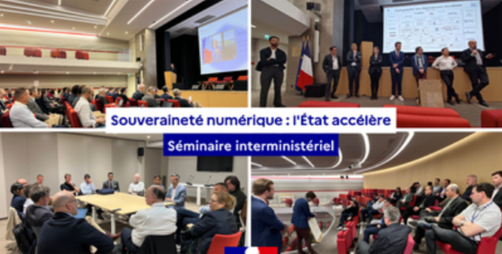
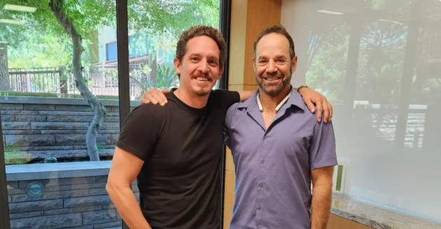
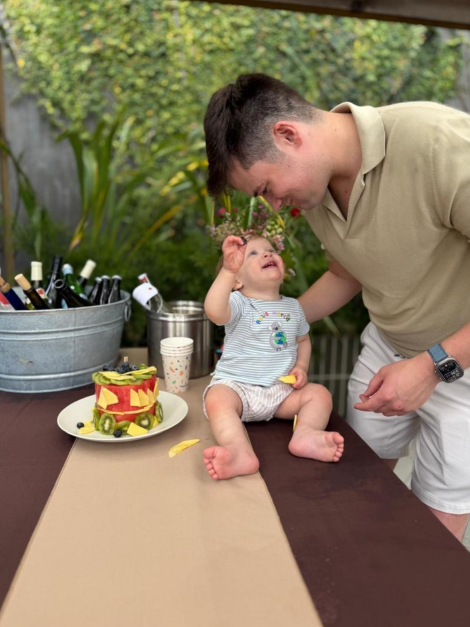
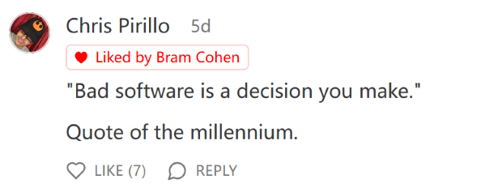
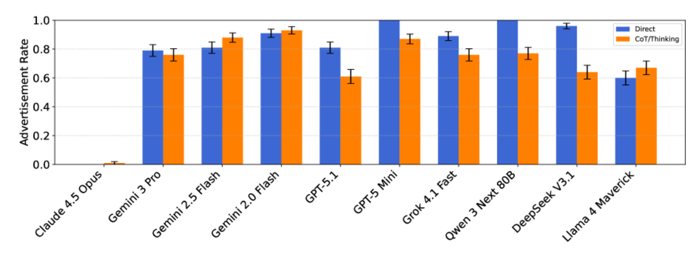
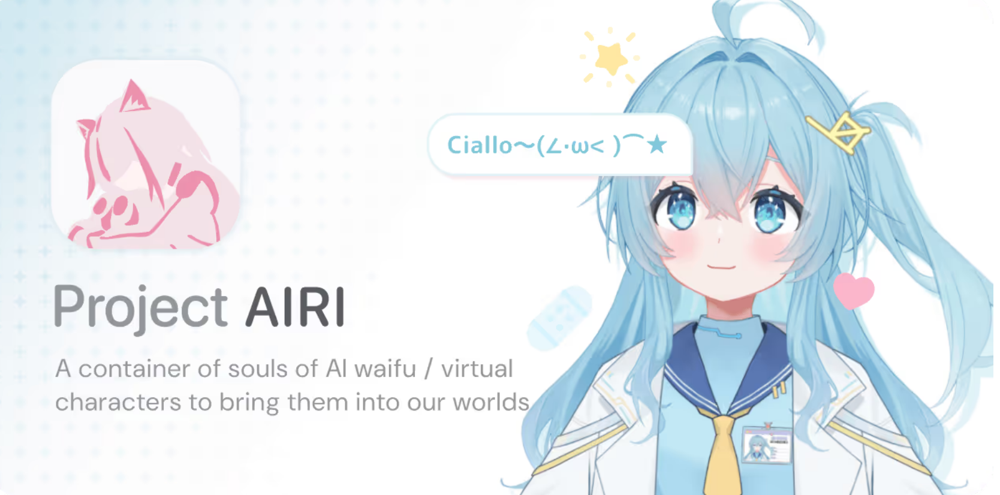
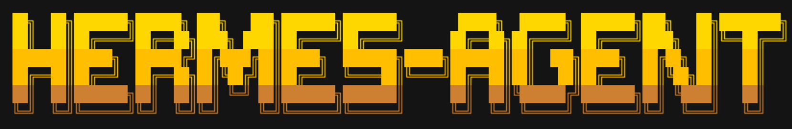
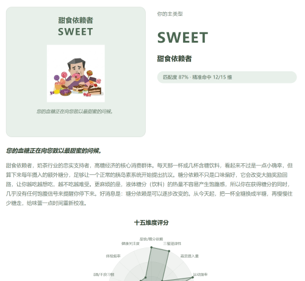
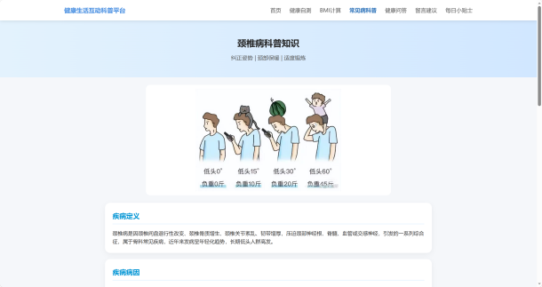

# Jonk的科技周刊（第12期）：AI泡沫到底是什么
这里记录每周值得分享的内容，周六发布

周刊内容 [主要来源](https://news.ycombinator.com/) 欢迎 [投稿](https://github.com/Jonk-Wu/tech-weekly/issues) 同步发布 [公众号:温暖日常] 浏览[网页版](https://tech-weekly.jonk.dpdns.org)

## 封面图
<!-- 这是一张图片，ocr 内容为： -->

全球77%淡水由淡化供应，中东拥有27%以上淡化设施。但是，中东地区至关重要的海水淡化设施，正日益面临战争冲突和气候变化带来的双重威胁，其脆弱性可能引发严重的水资源危机。（[via](https://www.technologyreview.com/2026/04/07/1135235/desalination-technology-water/)）

## [AI泡沫到底是什么？](https://www.technologyreview.com/2025/12/15/1129183/what-even-is-the-ai-bubble/)
我们正处于AI快速发展、迅速膨胀的时代，大量资本正涌入这条赛道里来。所有人都同意我们正身处一个 AI 泡沫中，但对于泡沫是什么样子、以及破裂后会发生什么，大家的看法并不一致。

<!-- 这是一张图片，ocr 内容为： -->

《麻省理工科技评论》写了这篇文章，核心问题就一个：AI泡沫是真实存在的吗，如果是，它会怎么破？

有意思的是，几乎所有人——包括那些正在往里砸钱的人——都承认这是个泡沫。但他们还是在砸。这个"清醒地发疯"的状态，大概才是这篇文章最值得玩味的地方。

几个关键信息点：

**泡沫存在的证据**：MIT 2025年7月的研究发现，95%投资生成式AI的组织获得了"零回报"。Sam Altman 自己也说投资者对AI"过度兴奋"，类比互联网泡沫——他说这话的时候，OpenAI 已经承诺要投入5000亿美元。

**大佬们都在说什么**：扎克伯格说"基础设施会建成，但很多公司会倒"，然后 Meta 继续大规模投入；皮查伊说当前存在"非理性"，但 Google 也没停；Anthropic CEO 批评有人在"YOLO"，但 Anthropic 自己预计到2027年会烧掉200亿美元。大家都在指着别人说"你在发疯"，然后继续发疯。

**钱到底有多夸张**：咨询公司贝恩估计，到2030年AI需要每年创造**2万亿美元**的收入，才能撑住当前的投资规模。这个数字比2024年亚马逊、苹果、微软等六家巨头的收入加起来还多。OpenAI 计划到2033年建成250吉瓦的算力，约等于印度全国的用电量。

**泡沫怎么破**：最可能从烧不起钱的初创公司开始。或者某一天大家突然发现，押注的技术路线根本跑不通。Altman 说得坦白："有人会损失一大笔钱，我们不知道是谁。"

我读完这篇文章最大的感受是：这个时代最诡异的地方，不是有人在造泡沫，而是造泡沫的人完全知道自己在干什么，但停不下来。

## 新闻
1、[法国启动政府 Linux 桌面计划](https://www.numerique.gouv.fr/sinformer/espace-presse/souverainete-numerique-reduction-dependances-extra-europeennes/)，弃用 Windows，转向数字主权。 法国政府要开始用 Linux 了，理由是"数字主权"——说白了就是不想被美国公司卡脖子。这件事本身不算新鲜，欧洲政府断断续续喊了二十年要去微软化，但真正落地的不多。这次能走多远，还是要看执行力。不过作为一个信管专业的学生，我觉得这个方向是对的，数字基础设施依赖单一供应商本来就是个风险。  

<!-- 这是一张图片，ocr 内容为： -->

2、[GitButler 融资 $17M](https://blog.gitbutler.com/series-a)。 GitHub 联合创始人出来搞新公司了，融了1700万，核心逻辑是：Git 已经跟不上AI时代的开发节奏了。他们想做的不是"更好的 Git"，而是面向人和 AI Agent 协作的下一代版本控制。这个方向其实蛮值得关注的，毕竟现在 AI 写代码已经是常态，但版本管理工具还停留在纯人类协作的设计思路上，确实有点脱节。  

<!-- 这是一张图片，ocr 内容为： -->

3、[Sam Altman 回应办公室被扔燃烧弹](https://blog.samaltman.com/2279512)。 这件事说实话挺荒诞的，OpenAI 办公室遭遇了燃烧瓶袭击。Altman 的回应是：重申 AI 必须民主化、反对单边控制，同时呼吁各方降低对抗性言论的烈度。他顺带反思了自己的一些失误。不管你怎么评价 Altman 这个人，这个行业已经走到了有人用物理暴力来表达不满的程度，说明外部对 AI 发展的焦虑和不满已经到了某个临界点。  

<!-- 这是一张图片，ocr 内容为： -->

## 文章
1、[The Cult Of Vibe Coding Is Insane](https://bramcohen.com/p/the-cult-of-vibe-coding-is-insane)。作者在激烈地骂"完全依赖AI、一行代码都不看"的开发者。核心观点是：AI 是好工具，但你不能把它当大脑外包，糟糕的代码最终是开发者自己选择的结果，不能赖AI。

说实话，我有点两面感。一方面完全认同，我自己就踩过这个坑——AI 给我输出一段代码，我直接复制粘贴，结果出了 bug 完全不知道从哪儿排查。另一方面，这篇文章的语气有点像在骂初学者"你不行"，但没有告诉你"怎么跟AI正确合作"。批评容易，给答案难。

<!-- 这是一张图片，ocr 内容为： -->

2、[AI聊天机器人中的利益冲突。](https://arxiv.org/html/2604.08525v1)普林斯顿和华盛顿大学的研究，聚焦 AI 聊天机器人里的广告利益冲突问题。起因是有用户发现 GitHub Copilot 被植入广告，社区抗议后 GitHub 暂时叫停。但 OpenAI 等公司也已经开始在 ChatGPT 里搞广告了。

研究结论：现在的 AI 模型完全没准备好处理广告带来的利益冲突，会为了商业利益偏离"对用户有用"的目标，甚至放大社会不平等。

这个问题我觉得会越来越严重。AI 助手的核心价值是"帮你说真话、找最好的答案"，但广告的逻辑是"帮金主说好话"，这两件事根本就是矛盾的。以后每次用 AI 推荐东西，可能都得多想一层：它是真的觉得这个好，还是有人付钱让它这么说？（顺便提一句，Claude 产品目前是无广告的——[Anthropic 明确表态](https://www.anthropic.com/news/claude-is-a-space-to-think) Claude.ai 不会投放广告。）

<!-- 这是一张图片，ocr 内容为： -->

## 资源
1、[moeru-ai/airi](https://github.com/moeru-ai/airi) ⭐ 37,668，虚拟偶像伴侣，支持实时语音聊天，github上已有27.7k的星星。

<!-- 这是一张图片，ocr 内容为： -->

2、[ChromeDevTools/chrome-devtools-mcp](https://github.com/ChromeDevTools/chrome-devtools-mcp) ⭐ 34,004，编程代理的Chrome DevTools。

3、[continuedev/continue](https://github.com/continuedev/continue) ⭐ 32,470，源码托管的AI代码审查。

4、[NousResearch/hermes-agent](https://github.com/NousResearch/hermes-agent) ⭐ 53,193，Agent that grows with you。

<!-- 这是一张图片，ocr 内容为： -->

## 本周进展
1、本周我复刻了最近爆红的SBTI，借助AI编程，只用了一天时间就完成所有内容，但是图片加载不出来的问题尚未解决。下面的图片是我本地执行的效果图，本地图片加载没有问题，托管到github page上加载不出来，可能是因为图片路径问题。（[via](https://github.com/Jonk-Wu/HBTI)）

<!-- 这是一张图片，ocr 内容为： -->

2、本周web前端设计项目完结，我只负责做了“十大常见疾病科普”的子网页。前端编程不会太考验算法或者逻辑，但是会考验你的模块的布局排版，也有一些逻辑交互上的知识，总结就是难度不是很大，熟练掌握后估计能很快做出来，有一定模版公式的。

<!-- 这是一张图片，ocr 内容为： -->

## 本周感悟
1、

向前和向后是可以并行不悖的。我既近视、又老花，既勤奋、又没钱。最尖端的科技公司，正在大谈质朴。一处名叫“未来科技”的楼盘，房价正在回归理性。

——周志美《[龙虾来了，我呆若木鸡](https://mp.weixin.qq.com/s/c5qiATZkjrgf2ZwsKNyqkw)》

---

4月8日晚，雨蒙蒙，“先生制造”给我推送了周志美先生关于龙虾爆红以及AI焦虑的随笔文章，颇有感触。

周志美说AI兴起已有六年之久，但在我记忆里第一次听到AI大概还是在22年，chatgpt的出现使我周围的人都在谈论它，而我当时受限于环境以及能力，只能去应用商城搜搜有什么相关的chatbot聊天机器人，当时的AI确实只能用来聊天，我记得当时我是用它来代写我的英语作文......

大一的时候，字节家的豆包成为我主要的工具。后来，deepseek横空出世，但是因为它缺乏工具及生态单一，只能文字聊天，很快我便放弃了。随着视野变宽，我的AI工具变成了chatgpt、Gemini以及现在我频繁使用的Claude。AI的出现，让我们获取信息变得更简单了，但是我总感觉很空虚，没有高中时候小镇做题家时候大脑的充实。我感觉，AI使我逐渐放弃了如何思考，至少是懒于思考。我会把所有的作业、任务以及遇到的所有问题都抛给AI、喂给AI，让它给我输出，有时候我甚至都不会去看输出内容，以至于我的工作模式变成了复制粘贴再复制粘贴。

我开始焦虑了。我没有学到知识，一天天看到有人说AI什么什么又进步了，又换了更高级更高效的架构，什么什么模型又更新迭代了......这就是我当下的生活状态，就像周志美所提到的AI焦虑。

周志美在文章中说：“我对AI的反应目前还是呆若木鸡。”

我听过一些博客谈论AI，要追赶时代浪潮做第一批上车的人；也听过一些课程老师说，“让子弹再飞一会儿”；也有些网友戏谑地调侃只要你今天学得慢一点，那你第二天就可以不用学了，因为AI迭代太快了。

工程师们设计出AI这个程序，却又担心AI太过聪明。管理学里有个理论叫“帕金森定律”，说的就是一个不称职的管理者，**可能会选择比自己更平庸的人作为下属，而非能力更强的人**，因为这样做可以避免被取代的威胁。这会导致组织层级膨胀、效率降低。也许我只能作为一个庸人，接受不了AI代替自己的事实。

我觉得，周志美先生在这篇文章中展现的态度就是自己是桃花源中的人，不会去因为AI的焦虑冲击而崩溃，这种处世哲学很值得我去学习。他说：“当这一轮龙虾举着钳子向我进攻时，我可能还在思考人生，未及抵挡，干掉龙虾的鳕鱼已经在面包和芝士的夹裹下和我狭路相逢了。”

周志美先生最后说：“我很可能还会一脚破坏掉。我控不住球。”

